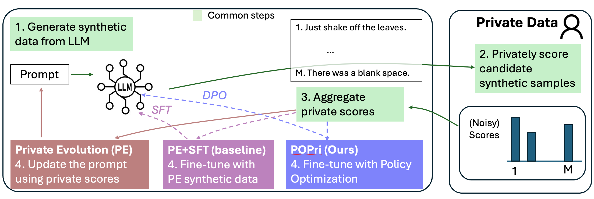
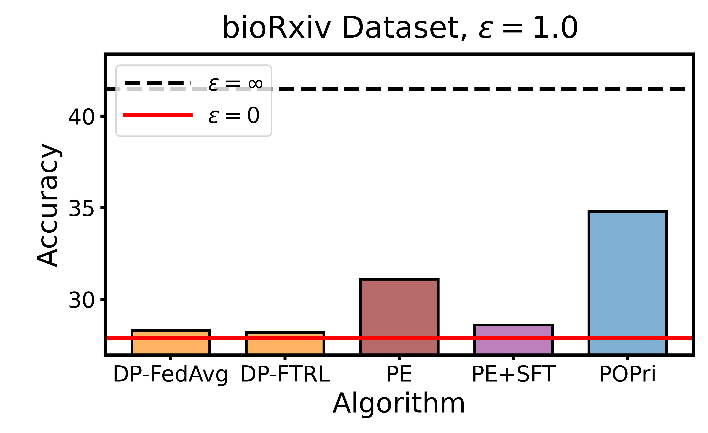

# [ICML2025] POPri: Private Federated Learning using Preference-Optimized Synthetic Data

📃 [Paper](https://arxiv.org/pdf/2504.16438) &middot; [bioRxiv Dataset](https://huggingface.co/datasets/hazylavender/biorxiv-abstract) &middot; [Congressional Dataset](https://huggingface.co/datasets/hazylavender/CongressionalDataset)

This repository implements POPri (Policy Optimization for Private Data), an algorithm that reformulates synthetic data generation into a reinforcement learning (RL) problem. 



We substantially improve the utility of DP synthetic data relative to prior work; on our bioRxiv dataset, POPri closes the gap between next-token prediction accuracy in the fully-private and non-private settings by up to 68%, compared to 52% for prior synthetic data methods, and 10% for state-of-the-art DP federated learning methods.



## News
* `08/15/2025`: Post-conference camera-ready update for ICML.
* `08/13/2025`: Gave an invited talk on POPri at OpenAI.
* `07/16/2025`: Poster session for POPri at ICML.
* `05/09/2025`: POPri is accepted by ICML!
* `04/23/2025`: Initial release of POPri code and paper.
* `04/03/2025`: POPri is selected as one of the [spotlight papers](https://synthetic-data-iclr.github.io/#papers) of ICLR’25 workshop [Will Synthetic Data Finally Solve the Data Access Problem?](https://synthetic-data-iclr.github.io).
* `03/03/2025`: POPri is accepted by the ICLR’25 workshop [Will Synthetic Data Finally Solve the Data Access Problem?](https://synthetic-data-iclr.github.io).

## Getting started
First, clone the repository.

We recommend using [conda](https://docs.conda.io/projects/conda/en/latest/user-guide/getting-started.html) to install the dependencies.

```
conda create -n myenv python=3.12 -y
conda activate myenv
pip install -r requirements.txt
```

## Data Preparation

The full unprocessed datasets are available at:
* [bioRxiv Dataset](https://huggingface.co/datasets/hazylavender/biorxiv-abstract)
* [Congressional Dataset](https://huggingface.co/datasets/hazylavender/CongressionalDataset)

We also provide the processed versions of the datasets (some truncation, splitting, partitioning into clients, etc.) that we used in our experiments in this [Google Drive Folder](https://drive.google.com/drive/folders/1NEMEWArlJKxrlgAG9eJt4vfvt0iHWF03?usp=drive_link). **Using these datasets together with the code in this repo will ensure compatibility.**

## Running POPri
You can run POPri to privately finetune an LLM to generate high-quality synthetic data similar to user data by going into the popri directory and running
```
sh run_popri.sh
```
In the script, `CONF_PATH` denotes the relative path of the yaml config for the experiment, and `CONF_NAME` is the name of the config in the path. We provide an example of the config for the bioarxiv experiment here `conf/bioarxiv/dpo_eps1.yaml`--the congressional config is nearly identical. There are a few important parameters to note:
* Under `dataset`, we can specify some POPri parameters like the number of preference pairs and the rank of the rejected sample.
* Under `training`, we can specify DPO training parameters.
* Under `federated`, we can specify the total number of clients and the number of clients to sample per round.
* Under `vllm_sampling`, we can specify the generation configs used to generate synthetic samples, like temperature or top p.
* Under `privacy.noise`, we can control the privacy noise multiplier.
* We will discuss `downstream_model` and `downstream_eval_settings` in the next section--these are settings we use to evaluate the POPri-trained LLM. You should leave this unspecified until the downstream evaluation.

To reproduce the runs in the paper, please modify the config to match the settings in the paper. In particular, you need to download the datasets from the Google Drive Folder noted above and place the paths into the config file. Check the config file for more info.

## Determining privacy
We provide a script to help with privacy accounting, `privacy_accountant.py`. To use it, follow these settings
* `q` is the fraction of clients sampled per round
* `steps` is the number of rounds
* `delta` is the delta setting you want

Now, given a desired $\epsilon$ value, simply guess-and-check `noise_multiplier` values until the accountant returns an $\epsilon$ (slightly) less than the desired $\epsilon$ value.


## Downstream evaluation
First, generate synthetic data using a given LLM checkpoint trained by the model. This is done with the command (using our example config).
```
python generate_downstream.py --config-path conf/bioarxiv --config-name dpo_eps1
```
Download a distilgpt2 checkpoint from here https://drive.google.com/file/d/1pZXBvumOyihb4cXLtY3PjIEYvyYxRqdK/view?usp=sharing which was finetuned on the c4 dataset. Put its filepath into the config file under `downstream_eval_settings.pretrained_eval_model_checkpoint`, and put the filepath that you trained with POPri into `downstream_eval_settings.generator_model`. Then we can run the downstream next token prediction training:
```
python downstream_eval.py --config-path conf/bioarxiv --config-name dpo_eps1
```
This script will return the best achieved accuracy by the downstream model from training on the generated synthetic data. Make sure to set the `downstream_eval_settings` appropriately if you want to reproduce the results in the paper.

## Citation

If you find our work helpful, please consider citing:

```bibtex
@misc{popri2025,
      title={POPri: Private Federated Learning using Preference-Optimized Synthetic Data}, 
      author={Charlie Hou and Mei-Yu Wang and Yige Zhu and Daniel Lazar and Giulia Fanti},
      year={2025},
      eprint={2504.16438},
      archivePrefix={arXiv},
      primaryClass={cs.LG},
      url={https://arxiv.org/abs/2504.16438}, 
}
```


